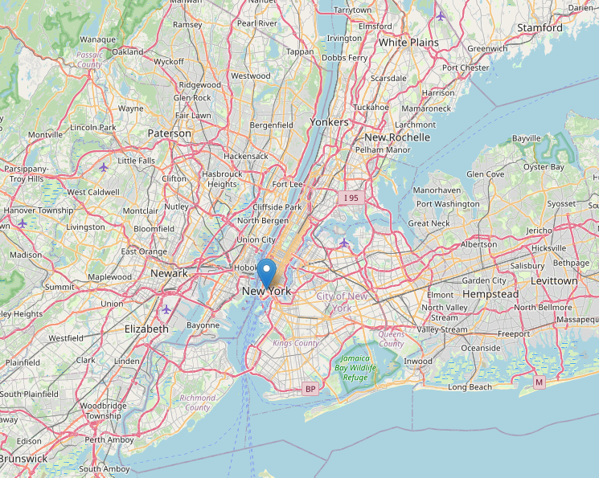
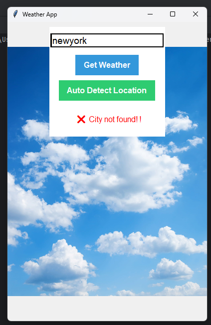
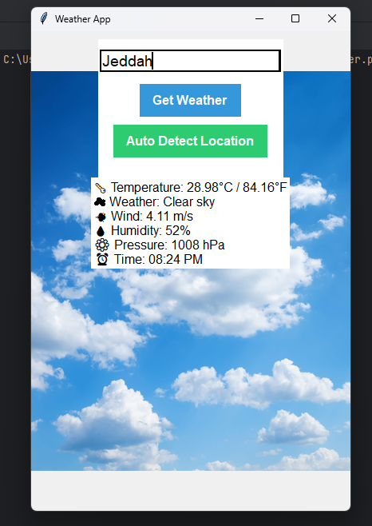
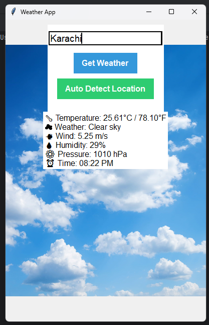
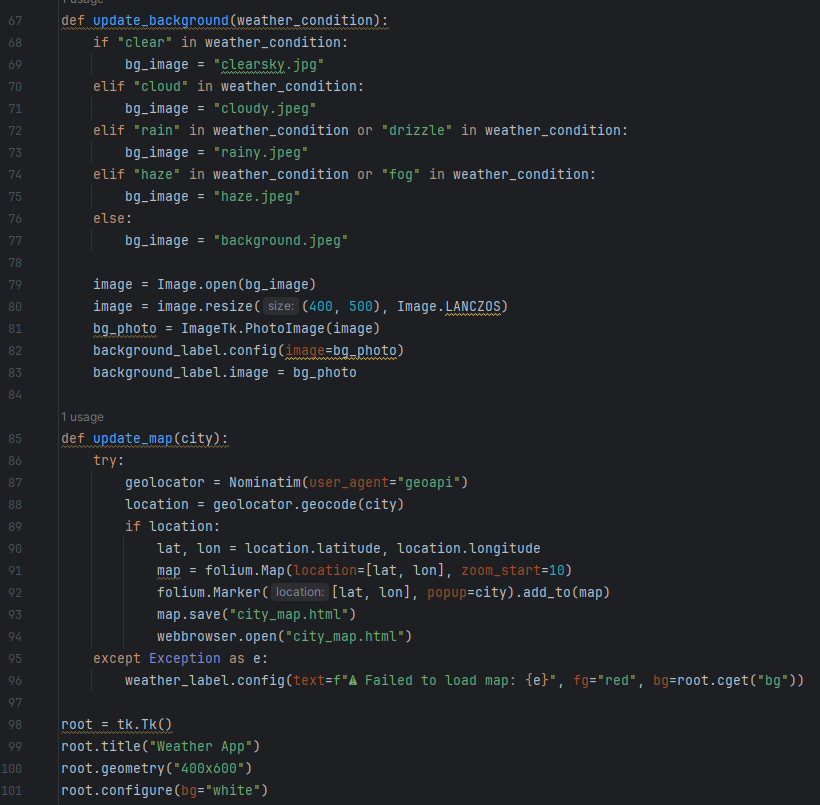
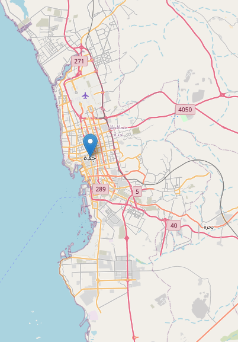
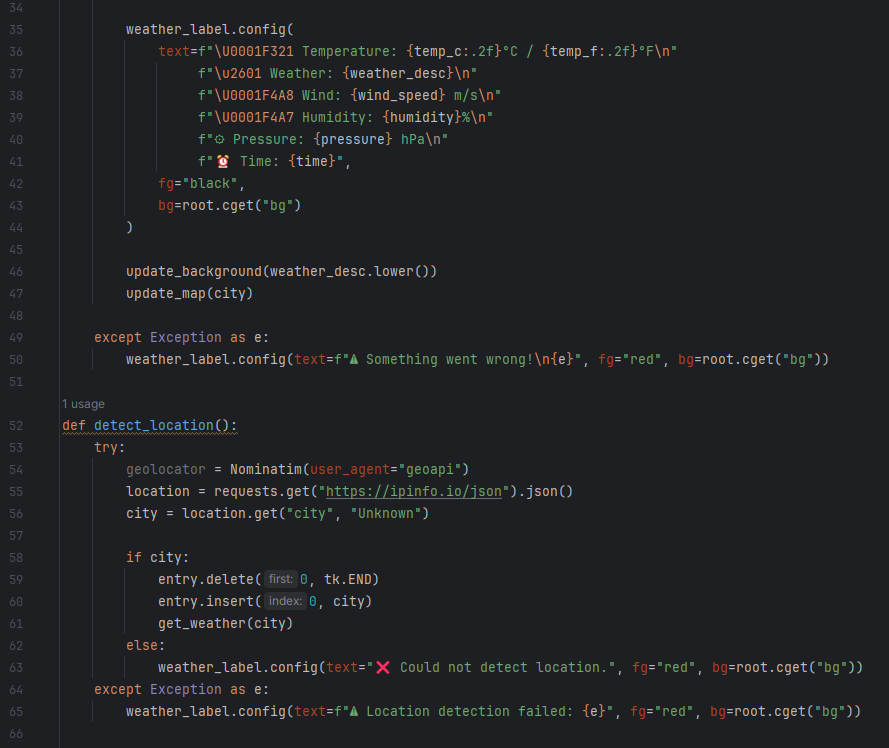

# 🌤️ Dynamic Weather App using API

> A sophisticated, dark-styled desktop weather application built with Python and Tkinter, featuring real-time data fetching, IP-based location auto-detection, a weather-responsive dynamic background engine, and interactive browser-based map rendering.

🎬 **Watch the Demo Video — Weather App:** [Google Drive Demo Video](https://drive.google.com/file/d/1YjR7V0I8KCxTS71GZ7cYqgZz2Z3IbQm2/view?usp=drive_link)

[](https://www.python.org/)
[](https://docs.python.org/3/library/tkinter.html)
[](https://openweathermap.org/)
[](https://python-visualization.github.io/folium/)
[](LICENSE)

---

## 🌟 Overview

The **Dynamic Weather App** is an advanced desktop GUI client developed as part of Python learning curriculum (Month 02). The application bridges the gap between desktop software and web APIs by integrating three separate remote services.

Upon launching, users can type in a city name or simply click **Auto Detect Location**. The app will fetch current weather parameters (Temperature in Celsius and Fahrenheit, wind speed, humidity, and atmospheric pressure). Depending on the weather condition, the UI background dynamically updates to clear sky, cloudy, rainy, or hazy imagery. Simultaneously, the app geocodes the city into coordinates using **Geopy (Nominatim)**, generates a local interactive leaflet map page using **Folium**, and automatically opens it in the user's default web browser.

---

## 📸 Screenshots

### 1. Interactive Folium Leaflet Map (Opens automatically in browser)
<p align="center">
  
</p>

### 2. Live Weather Output & Dynamic Weather Backgrounds
<p align="center">
   &nbsp;
   &nbsp;
</p>
<p align="center">
   &nbsp;
   &nbsp;
</p>

### 3. Location Auto-Detection Progress
<p align="center">
   &nbsp;&nbsp;
  
</p>

---

## ✨ Features

- **📡 Real-Time API Fetching**: Queries the OpenWeatherMap API in metric units and formats data into temperatures (°C & °F), wind speed (m/s), humidity (%), and pressure (hPa).
- **🟢 IP-Based Location Auto-Detection**: Uses `ipinfo.io` to parse the user's active IP address and automatically resolve their current city, populating the input fields instantly.
- **🖼️ Weather-Responsive Backgrounds**: A dynamic styling engine updates the Tkinter background image based on current weather descriptions:
  - `clear` -> `clearsky.jpg`
  - `cloud` -> `cloudy.jpeg`
  - `rain` / `drizzle` -> `rainy.jpeg`
  - `haze` / `fog` -> `haze.jpeg`
  - Other conditions -> `background.jpeg` (Default)
- **🗺️ Interactive Map Integration**: Uses Geopy's `Nominatim` to retrieve the latitude and longitude coordinates of the target city, builds an interactive leaflet-styled map via `folium.Map`, saves it as `city_map.html`, and launches it in the system browser using Python's `webbrowser` utility.
- **🛡️ Secure Exception Handling**: Wrap-around `try/except` statements handle common failures such as network timeouts, unknown cities, empty queries, or invalid API headers gracefully without causing thread locks.

---

## 🛠️ Tech Stack & API Endpoints

| Component | Technology / Endpoint | Description |
| :--- | :--- | :--- |
| **Language** | Python 3.8+ | Core development language |
| **GUI Framework** | `tkinter` & `PIL (Pillow)` | Handles layouts, buttons, and dynamic image cropping |
| **HTTP Queries** | `requests` | Performs REST calls to JSON API endpoints |
| **Weather API** | `api.openweathermap.org/data/2.5/weather` | Fetches real-time temperature, wind, and humidity |
| **Location API** | `ipinfo.io/json` | Retrieves current public IP location details |
| **Geocoding API**| `geopy.geocoders.Nominatim` | Resolves string cities to exact latitude & longitude |
| **Map Engine** | `folium` | Renders interactive Leaflet maps saved as local HTML |
| **Browser Runner**| `webbrowser` | Opens the folium map automatically in Chrome/Edge/Firefox |

---

## 📁 Project Structure

```
Weather-app-using-API/
│
├── weather.py             # Main application script — API requests, Tkinter layout, map builder
├── clearsky.jpg           # Background image for clear weather
├── cloudy.jpeg            # Background image for cloudy weather
├── rainy.jpeg             # Background image for rainy weather
├── haze.jpeg              # Background image for hazy/foggy weather
├── background.jpeg        # Default starting background image
├── 5555.docx              # Project documentation with screenshots & activity log
├── screenshots/
│   ├── screenshot_1.png   # Folium Map loaded in default web browser
│   ├── screenshot_2.png   # Coordinates mapping in log
│   ├── screenshot_3.png   # Clear sky background state
│   ├── screenshot_4.png   # Haze weather background state
│   ├── screenshot_5.png   # Cloudy weather background state
│   ├── screenshot_6.png   # Rainy weather background state
│   ├── screenshot_7.png   # Location auto-detection screen
│   ├── screenshot_8.png   # Validation warning screen
│   ├── screenshot_9.png   # City coordinate lookup console log
│   ├── screenshot_10.png  # Map save execution feedback log
│   ├── screenshot_11.png  # Leaflet HTML rendering log
│   └── screenshot_12.png  # Initial app startup state
└── README.md
```

---

## ⚙️ How It Works

```
User enters city OR clicks [Auto Detect Location]
                      ↓
If Auto Detect:
  - Query ipinfo.io/json → Extract "city"
  - Populate the Entry widget with the resolved city
                      ↓
Trigger get_weather(city):
  - Send GET request to OpenWeatherMap API
  - Parse JSON payload (Main, Wind, Weather nodes)
  - Display results on text labels
                      ↓
Simultaneously:
  - Run update_background(weather_condition) to swap images
  - Run update_map(city) → Geocode city via Nominatim
  - Create folium.Map with markers
  - Save as city_map.html
  - Call webbrowser.open("city_map.html") to load map in browser
```

---

## 🚀 Getting Started

### Prerequisites
- **Python 3.8** or higher
- **Pillow** (PIL fork for images)
- **Requests** (for HTTP API calls)
- **Folium** (for Leaflet maps)
- **Geopy** (for coordinate geocoding)

---

### Setup Instructions

**1. Clone the Repository:**
```bash
git clone https://github.com/AnasQ2003/Weather-app-using-API.git
cd Weather-app-using-API
```

**2. Install Required Python Libraries:**
```bash
pip install pillow requests folium geopy
```

**3. Run the Weather Application:**
```bash
python weather.py
```

---

## 💡 Key Concepts Demonstrated

| Concept | How It's Used |
| :--- | :--- |
| **API Web Requests** | `requests.get()` queries OpenWeatherMap and ipinfo.io |
| **JSON Extraction** | Parses nested dictionary structures (`data["main"]["temp"]`) |
| **Geocoding** | `Nominatim` translates city names to `(latitude, longitude)` coordinates |
| **HTML Canvas Creation**| `folium` generates map canvas objects, markers, and HTML outputs |
| **Dynamic Backgrounds**| `Image.open` and `ImageTk.PhotoImage` swap root window layers dynamically |
| **Double Temp Units** | Celsius results are mathematically mapped to Fahrenheit: `(C * 9/5) + 32` |
| **Layout Layering** | `.place(relwidth=1, relheight=1)` stretches background label behind input widgets |

---

## 🧠 Learning Objectives 
> ✅ **Objective**: Understand how to interact with third-party APIs using Python's `requests` library, extract valuable keys from complex nested JSON payloads, and leverage geocoding and mapping scripts to overlay data on interactive visual components.

**Activities Completed:**
- ✔️ Configured OpenWeatherMap client requests to fetch real-time temperatures.
- ✔️ Integrated `ipinfo.io` to fetch client IP geolocation.
- ✔️ Implemented Nominatim engine configurations to look up GPS coordinates.
- ✔️ Wrote dynamic image loaders to change application themes based on API status codes.
- ✔️ Rendered interactive HTML maps using Folium, deploying them automatically to local browser instances.

**Key Takeaways:**
- APIs are the backbone of modern interconnected applications, bridging local programs with global services.
- JSON hierarchies require rigorous parsing to extract values safely.
- GUI responsiveness is significantly enhanced when visual indicators match real-world parameters (e.g. rain backgrounds on wet weather).
- Python simplifies web-browser handshakes using standard library launchers like `webbrowser`.

---

## 📄 License

```
MIT License

Copyright (c) Weather App---2026 AnasQ2003

Permission is hereby granted, free of charge, to any person obtaining a copy
of this software and associated documentation files (the "Software"), to deal
in the Software without restriction, including without limitation the rights
to use, copy, modify, merge, publish, distribute, sublicense, and/or sell
copies of the Software, and to permit persons to whom the Software is
furnished to do so, subject to the following conditions:

The above copyright notice and this permission notice shall be included in all
copies or substantial portions of the Software.

THE SOFTWARE IS PROVIDED "AS IS", WITHOUT WARRANTY OF ANY KIND, EXPRESS OR
IMPLIED, INCLUDING BUT NOT LIMITED TO THE WARRANTIES OF MERCHANTABILITY,
FITNESS FOR A PARTICULAR PURPOSE AND NONINFRINGEMENT.
```

---

## 👨‍💻 Author

**Anas Ahmed Qureshi.** — [@AnasQ2003](https://github.com/AnasQ2003)

---

<div align="center">
  <p>Built with ❤️ by <strong>Anas</strong></p>
  
 <div align="center">

Made with 💧 and a lot of ☕

**⭐ If you found this useful, please star the repository!**

*Stay hydrated. Stay healthy.*

</div>
